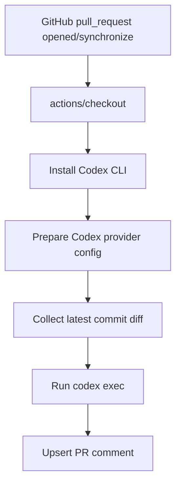

# Codex Reviewer 技术方案

## 推荐方案

采用“外层 GitHub Action 编排 + Codex CLI 执行”的方案：

- 外层 Node.js 程序负责 GitHub 事件解析、最新 commit diff 获取、Codex provider 配置、PR 评论。
- Codex 只负责基于 prompt 和 diff 生成审查结果。
- 模型 API 通过 `CODEX_HOME/config.toml` 配置为 Responses-compatible provider。

## 架构



## 核心决策

### ADR-001: 只审查最新 commit

状态：已采纳

原因：用户明确要求 PR 多次提交时，只审查最后一次提交，避免重复审查旧内容。

实现：使用 GitHub Compare API 比较 `head.sha^` 到 `head.sha`，而不是比较 PR base 到 head。

### ADR-002: 第一版只支持 Responses-compatible provider

状态：已采纳

原因：Codex `model_provider` 原生支持 `wire_api = "responses"`；协议转换会增加复杂度和安全风险。

实现：Action 进程启动本地 proxy，Codex 配置只指向本地地址：

```toml
model_provider = "codex-reviewer"
model = "<input model>"

[model_providers.codex-reviewer]
name = "Codex Reviewer Provider"
base_url = "http://127.0.0.1:<port>/v1"
wire_api = "responses"
```

### ADR-003: 第一版输出 summary comment

状态：已采纳

原因：inline comments 需要精确映射 diff position，容易在第一版引入噪声。summary comment 能先验证审查价值。

## 安全策略

- 不提供 provider fallback。
- `provider-api-key` 只保留在 Action 进程内，用于本地 proxy 转发上游请求。
- 不把 key 写入 `config.toml`。
- 不把 key 注入 Codex 子进程环境。
- 默认 `sandbox` 为 `read-only`。
- 使用最小 GitHub permissions：`contents: read`、`pull-requests: write`。

## 测试策略

- 单元测试 `latestCommitRange`：保证只取最新 commit。
- 单元测试 `buildPrompt`：保证 prompt 明确限定最新 commit。
- 单元测试 `renderCodexConfig`：保证 provider 配置正确且不写入 key。
- 单元测试 `buildCodexArgs`：保证调用 `codex exec` 参数稳定。
