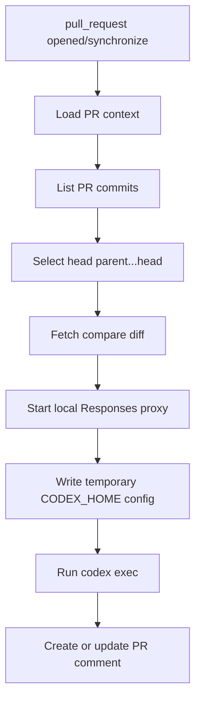

# 架构设计

## 关键约束

- 只审查 `pull_request.head.sha` 对应 commit。
- Provider 必须兼容 Codex `wire_api = "responses"`。
- 不实现自动降级或 fallback。
- 默认 Codex sandbox 为 `read-only`。
- Codex 只连接本地 `127.0.0.1` proxy；provider key 不进入 Codex 子进程环境。
